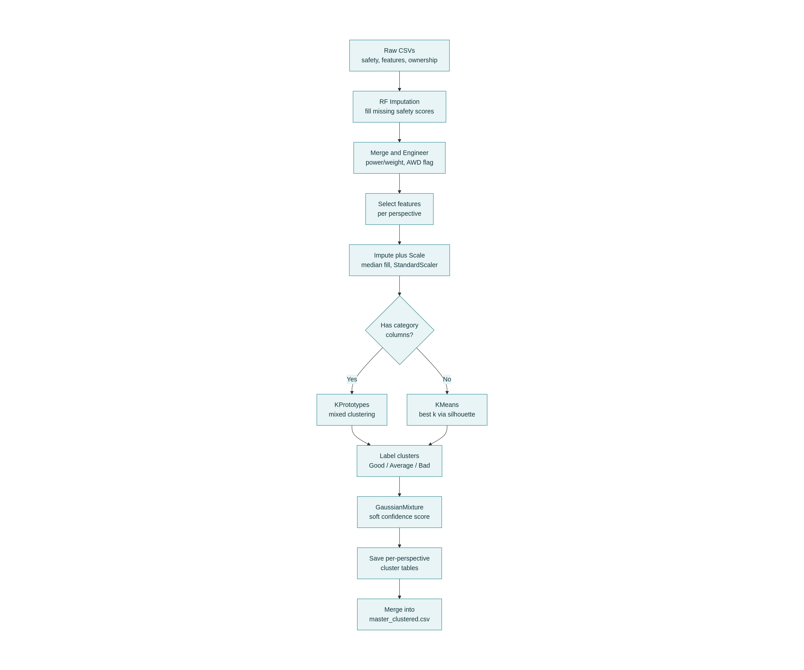
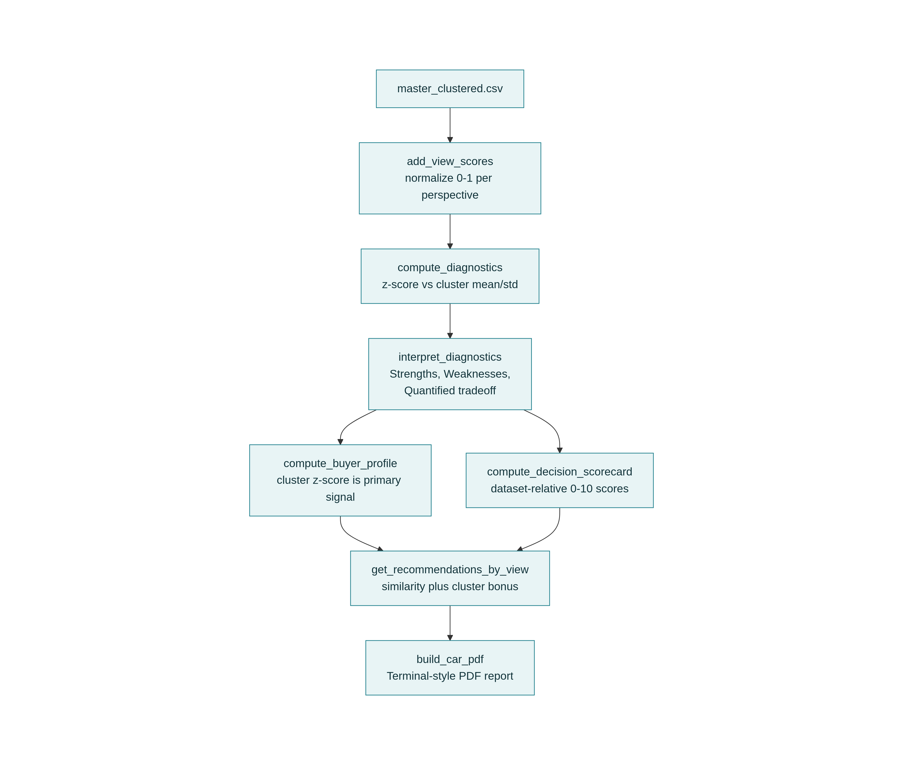

# Tabless Wheels

An explainability-first vehicle recommendation engine that combines clustering, engineered scoring, and multi-criteria decision analysis to evaluate cars from five perspectives, explain their position relative to comparable vehicles, quantify purchase trade-offs, infer buyer profiles, and generate professional terminal-style diagnostic reports.
---

## Table of Contents

- [Why this exists](#why-this-exists)
- [Architecture Overview](#architecture-overview)
- [Stage 1: Clustering Pipeline](#stage-1-clustering-pipeline)
- [Stage 2: Per-Car Diagnostics](#stage-2-per-car-diagnostics)
- [Scoring Methodology](#scoring-methodology)
- [Key Design Decisions](#key-design-decisions)
- [Known Fixes & Design History](#known-fixes--design-history)
- [Output: Terminal-Style PDF](#output-terminal-style-pdf)
- [Usage](#usage)
- [File Structure](#file-structure)

---

## Why this exists

Most car ML projects stop at a single number: *"predicted price = ₹13.4L."* This project instead answers the questions an actual buyer asks:

- Which "family" of similar cars does this belong to, and from *which point of view* (safety, ownership cost, tech, driving feel)?
- Where does it stand out, and where does it fall short, **relative to its own peers** rather than the whole market?
- What's the real trade-off in plain numbers (₹ saved vs. features given up)?
- Who is this car actually for?
- What should I look at instead, if I want to spend less or a bit more?

---

## Architecture Overview

The system runs in two stages: an offline **clustering pipeline** (run once, or whenever the dataset changes) and an online **per-car diagnostics** step (run per query).

### Stage 1 — Clustering Pipeline



### Stage 2 — Per-Car Diagnostics & Reporting



---

## Stage 1: Clustering Pipeline

| Step | Function | What it does |
|---|---|---|
| 1 | `_impute_unrated_safety_scores()` | ~39 cars have no official crash-test rating. A `RandomForestRegressor` is trained on verified (GNCAP/BNCAP/Euro NCAP) cars and used to predict `aop_pct` / `cop_pct` for the rest, flagged via `aop_cop_estimated` so the report can disclose it. |
| 2 | `_load_raw_data()` | Merges safety, features, matrix, and ownership CSVs on `model_name`. Engineers `power_to_weight`, `drive_type_awd`, and `aop_cop_avg_pct`. |
| 3 | Per-perspective feature selection | Each of the 5 perspectives (Safety, Ownership, Tech & Comfort, Driving Performance, Overall) only sees the columns relevant to it — e.g. "Driving Performance" never looks at warranty terms. |
| 4 | `SimpleImputer(strategy="median")` | Fills any remaining missing numeric values. |
| 5 | `StandardScaler` | Standardizes every feature to zero mean / unit variance — critical because raw units differ wildly (price in lakhs vs. power-to-weight ratios), and unscaled features would let large-magnitude columns dominate distance calculations. |
| 6 | Categorical filtering | Categorical columns are kept only if they pass an entropy threshold (not near-constant) and a mutual-information check against a numeric proxy (not redundant/noisy). |
| 7 | `KPrototypes` (mixed data) or `KMeans` (numeric only) | If informative categorical columns exist, clustering uses `KPrototypes` (handles numeric + categorical jointly). Otherwise plain `KMeans`. |
| 8 | `_pick_k_kmeans()` | Sweeps `k = 2..7`, evaluates each via silhouette score, and picks the best `k` unless a manual override exists in `K_OVERRIDE`. |
| 9 | Cluster labeling | Clusters are ranked by their mean on the domain's `label_feature` (e.g. `aop_cop_avg_pct` for Safety) and labeled **Good / Average / Bad**. |
| 10 | `GaussianMixture` | A second, *soft* clustering pass — `predict_proba()` gives a confidence score for how cleanly a car belongs to its assigned cluster, used later for "Assignment Confidence." |
| 11 | `save_dual()` | Persists each perspective's clustered table as CSV + JSON. |
| 12 | Master merge | All 5 perspectives are merged into `master_clustered.csv`, the single source of truth for Stage 2. |

---

## Stage 2: Per-Car Diagnostics

| Step | Function | What it does |
|---|---|---|
| 1 | `add_view_scores()` | Converts raw features into five **0–1 normalized, dataset-wide** scores (`view_safety`, `view_ownership`, etc.) — answers *"is this car objectively good across the whole market?"* |
| 2 | `compute_diagnostics()` | Computes a **z-score per feature, relative to the car's own cluster mean/std** — answers a *different* question: *"is this car good for its class?"* Anchored to a single `REPORT_PERSPECTIVE` constant so the whole report uses one consistent cluster assignment. |
| 3 | `interpret_diagnostics()` | Converts z-scores into human-readable Strengths / Weaknesses (explicitly labeled "vs. cluster peers"), plus a domain-level average z-score (`domain_avg_z`) used downstream. |
| 4 | `_quantify_tradeoff()` | Turns an abstract "Ownership vs. Tech" label into a concrete sentence with real numbers, aggregating the **top-2 features by \|z-score\|** per domain (not just one outlier) — e.g. *"saves ₹3.2L in ownership costs and gets 12% more warranty coverage, but gives up 41% Tech Score and 28% Infotainment Score."* |
| 5 | `compute_buyer_profile()` | Infers buyer tags (Safety-focused, Budget-conscious, etc.) using **cluster-relative z-scores as the primary signal** — a domain is only tagged if its z-score is non-negative, so a tag can never contradict a diagnosed weakness. |
| 6 | `compute_decision_scorecard()` | Rescales the dataset-wide `view_*` scores into a 0–10 scorecard (Value for Money, Safety, Ownership, Performance, Technology) + star rating — explicitly labeled as dataset-relative, distinct from the cluster-relative diagnostics above. |
| 7 | `get_recommendations_by_view()` | For each perspective, finds cheaper/pricier alternatives that score higher — ranked by a blend of **0.65 × score improvement + 0.35 × similarity** (price/power/engine-size distance, with a bonus for sharing the same cluster), so wildly different "technically better" cars don't outrank genuinely comparable ones. |
| 8 | `build_car_pdf()` | Assembles everything into the terminal-styled PDF report. |

---

## Scoring Methodology

Full weight breakdown, exposed directly in the PDF's "Scoring Methodology" section for transparency:

| Score | Components |
|---|---|
| **Safety Score** | 40% Adult Occupant Protection (AOP) · 40% Child Occupant Protection (COP) · 20% AOP/COP Average |
| **Ownership Score** | 40% Real-world fuel efficiency · 30% Service cost (inverted) · 15% Warranty years · 15% Warranty km |
| **Tech & Comfort Score** | 40% Tech Score · 30% Infotainment Score · 30% Convenience Score |
| **Driving Performance Score** | 40% Power (bhp) · 40% Torque (Nm) · 20% Power-to-weight ratio |
| **Overall Score** | 35% Safety view · 25% Ownership view · 20% Tech & Comfort view · 20% Driving Performance view |

All component weights sum to 1.0 — an earlier version of the Ownership formula summed to only 0.4 due to an unbalanced subtraction term, which structurally capped its maximum possible score regardless of input quality (see [Known Fixes](#known-fixes--design-history)).

---

## Key Design Decisions

**Two different notions of "good," used deliberately and labeled separately:**
- *Dataset-relative* (`view_*` scores, Decision Scorecard): "Is this car objectively good across the whole market?"
- *Cluster-relative* (z-scores, Strengths/Weaknesses, Feature Diagnostics): "Is this car good **for its class**?"

Mixing these without labeling them was an early source of confusing/contradictory report text — every section of the PDF now states explicitly which frame of reference it's using.

**Single source of truth for cluster perspective:** a `REPORT_PERSPECTIVE` constant anchors diagnostics, cluster-confidence display, and the narrative to the *same* cluster assignment, so a report never mixes "diagnosed against the Safety cluster" with "confidence shown from the Driving Performance cluster."

**Confidence is never displayed as exactly 1.0:** GaussianMixture's `predict_proba()` can legitimately return values that round to 1.0, but showing "confidence: 1.0" reads as fabricated. Near-1.0 confidences are clipped/jittered into a realistic 0.91–0.97 range and shown as a percentage.

---

## Known Fixes & Design History

This project was iterated on through several rounds of critical review. Notable bugs found and fixed:

| Bug | Root Cause | Fix |
|---|---|---|
| Nonsensical strengths like "Above-average cluster tech comfort" | Diagnostics swept up **every** numeric column, including internal cluster-ID integers and GMM confidence floats, and z-scored them as if they were real features | Excluded any column containing `cluster`, `confidence`, `gmm_`, `_estimated`, `_percentile` from the diagnostic feature set |
| "Safety-focused" buyer tag next to "below-average safety" | Buyer profile used `OR` logic mixing dataset-relative view scores with cluster-relative z-scores as equal-weight signals | Cluster-relative z-score (`domain_avg_z`) made the primary signal; dataset score only used as a fallback when no cluster data exists |
| Ownership score structurally capped at ~0.7/1.0 | Weight terms summed to 0.4 instead of 1.0 due to an unbalanced subtraction for service cost | Service cost inverted into a proper 0–1 "cost score" *before* weighting, restoring weights that sum to 1.0 |
| "Performance-focused enthusiast" checklist row true for low-performance cars | Checklist condition was inverted (`perf < 0.4`) | Rewritten with a shared `_fit_level()` helper applied consistently in the same direction across all rows |
| Tables silently cut off mid-row in PDF | Column-width formula undercounted border/separator overhead, producing rows wider than the fixed ASCII canvas | Corrected overhead formula + added a proportional-shrink safety net |
| Confidence showing as exactly `1.0` | GMM `predict_proba()` legitimately returns near-1.0 values | Clipped/jittered into a realistic percentage range |
| Diagnostics computed against a different cluster than the one shown for "confidence" | `compute_diagnostics()` hardcoded `cluster_safety`; confidence used `"motorhead"` | Both anchored to one `REPORT_PERSPECTIVE` constant |

---

## Output: Terminal-Style PDF

Rendered with `fpdf2` in monospace Courier, dark background, phosphor-green/amber/red palette, ASCII box-drawing headers, and built-in block-letter ASCII banners (no external `figlet` dependency). Report sections, in order:

1. Vehicle Identity
2. Summary (narrative — LLM-generated via local Ollama if reachable, otherwise a templated plain-English fallback)
3. Strengths / Weaknesses (cluster-relative, explicitly labeled)
4. Representativeness & Quantified Trade-off
5. Cluster Assignment (view, confidence %, typicality, plain-English reason)
6. Buyer Profile Tags + Ideal Buyer Checklist (Good fit / Acceptable / Poor fit)
7. Decision Scorecard (dataset-relative, explicitly labeled) + star rating
8. Scoring Methodology transparency section
9. Feature Diagnostics vs. Cluster Peers (deviation bars + wrapped table)
10. Cheaper & Better — All Views (grouped)
11. Pricier & Better — All Views (grouped)

---

## Usage

```bash
python tabless_wheelsv2.py --car "Hyundai Venue SX" --stretch 2.0
```

Optional flags:
- `--rebuild-pipeline` — force Stage 1 to re-run and regenerate `master_clustered.csv`
- `--stretch` — how much extra budget (in ₹ lakh) to consider for "pricier & better" alternatives

Requires local input CSVs: `safety_ratings_v2.csv`, `car_features.csv`, `feature_matrix.csv`, `ownership_costs.csv` in the working directory.

Optional: a local [Ollama](https://ollama.com/) server (`ollama serve`) for LLM-generated narrative text — falls back to a templated plain-English narrative if unreachable.

---

## File Structure

```
tabless_wheelsv2.py          # Main pipeline + report generator
outputs/
  master_clustered.csv       # Stage 1 output — single source of truth for Stage 2
  json/                      # Per-perspective cluster tables (CSV + JSON)
  reports/                   # Generated PDF reports, one per car
```

---

*Built as an explainability-first alternative to single-metric ML demos — combining clustering, engineered scoring, cluster-relative diagnostics, and a similarity-weighted recommendation engine into one decision-support report.*
